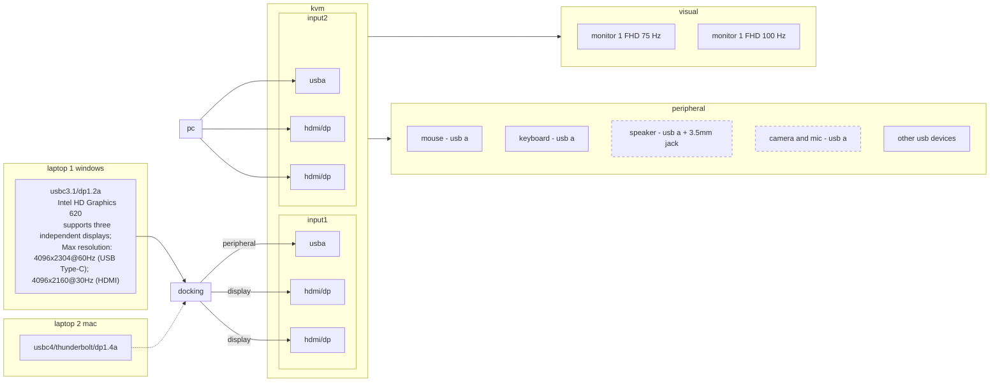
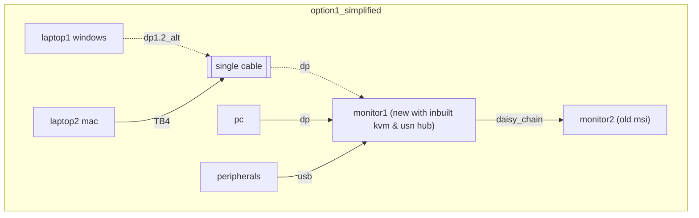
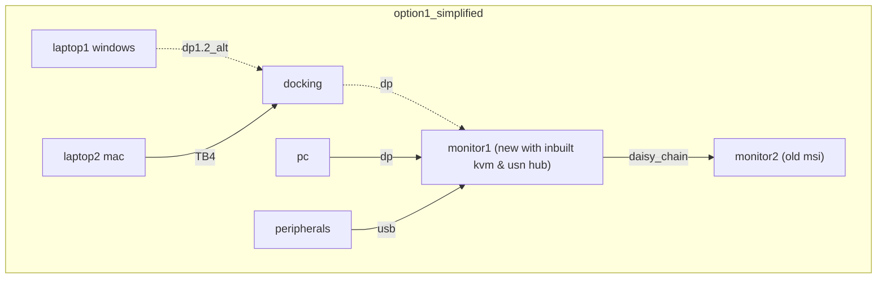
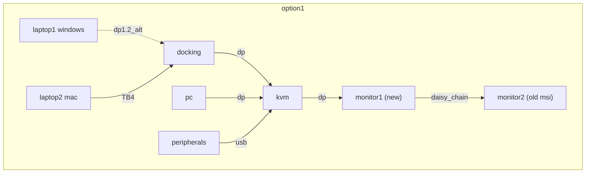
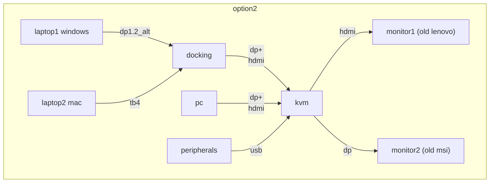

# State
2 x 1920×1080 monitors

laptop:
2 x usb 3.1 ~ dp 1.2a
1 x hdmi 1.4b

pc:
1 x HDMI 2.1 
3 x DisplayPort 1.4a

laptop 2 

    3 x Thunderbolt 4 (USB-C) ports with support for:
        Charging
        DisplayPort
        Thunderbolt 4 (up to 40 Gbps)
        USB 4 (up to 40 Gbps)

# list of questions/problems that one need to solve to get this working
1. does mac support usb c split between either:
  - 2 dp
  - 2 hdmi
  - dp + hdmi
- if yes then
1. can the dock support mst multi stream transport
2. can the kvm suppport mst 
3. 
https://www.reddit.com/r/mac/comments/1h58a3h/why_doesnt_apple_support_mstmulti_stream_transport/

# initial idea/plan

# information on daisy chaining
https://www.anker.com/blogs/hubs-and-docks/how-to-daisy-chain-monitors-with-displayport

1. Check that your gear supports MST

    GPU: Your laptop or graphics card must have a DisplayPort 1.2 (or newer) output that specifically lists MST support.
    Monitors: Every screen in the chain needs a DisplayPort 1.2+ input, and any monitor that comes before the last one in the chain also needs a DisplayPort output (usually labeled "DP Out") to pass the signal along. The last one can be an input-only model.

    > Thunderbolt 4 host systems are guaranteed to support VESA DP Alt Mode and USB 3.2 Gen 2 as "fallback" modes. 
    > https://www.reddit.com/r/UsbCHardware/comments/r0o3bu/comment/hlu8avv/?utm_source=share&utm_medium=web3x&utm_name=web3xcss&utm_term=1&utm_content=share_button

> Apple does not support MST. The DP feature that allows running multiple displays via a single DP connection. The rest of the world does.
> Your monitor uses a TB-Hub not a MST-Hub. So the 2nd DP connection can only be available from a TB/USB4 host that offers 2 DP connections. So without TB/USB4 host, you are out of luck.
> Most monitors will have an MST-Hub not a TB Hub (they will then call it a DP-output). And those would not work for Apple hosts, because Apple boycotts MST.
> (note that both technologies are actually based on Hub-topology nowadays. "daisy-chaining" just describes the way you want to wire your peripherals "in a chain". Which you can do, but neither technology is actually limited to)
> https://www.reddit.com/r/UsbCHardware/comments/1cb5qf1/comment/l0x3i7e/?utm_source=share&utm_medium=web3x&utm_name=web3xcss&utm_term=1&utm_content=share_button

## tables from copilot gpt 4.1
| Standard         | Max Speed     | Connector Type   | Power Delivery (PD) Max | PD Voltage/Ampere Pairs              | Backward Compatibility Details                                                                                  | Daisy Chaining Support                | MST (Multi-Stream Transport) Support         | Min Video Output      | Release Year |
|------------------|---------------|------------------|------------------------|--------------------------------------|----------------------------------------------------------------------------------------------------------------|---------------------------------------|----------------------------------------------|-----------------------|--------------|
| **USB 3.1**      | 10 Gbps       | USB-A, USB-C     | 100W                   | 5V/2A, 12V/1.5A, 20V/5A              | USB 2.0/1.1 devices and ports (same connector)                                                                 | No                                    | No                                           | N/A                   | 2013         |
| **USB 3.2**      | 20 Gbps       | USB-A, USB-C     | 100W                   | 5V/2A, 12V/1.5A, 20V/5A              | USB 2.0/3.0/3.1 devices and ports (same connector)                                                             | No                                    | No                                           | N/A                   | 2017         |
| **USB 4**        | 40 Gbps       | USB-C            | 100W                   | 5V/2A, 9V/3A, 15V/3A, 20V/5A         | USB 3.x, USB 2.0, Thunderbolt 3 (if host supports TB3 fallback)                                                | No (USB only, but supports MST via DP)| Yes, via DP Alt Mode over USB-C              | 1x 4K                 | 2019         |
| **Thunderbolt 3**| 40 Gbps       | USB-C            | 100W                   | 5V/3A, 9V/3A, 15V/3A, 20V/5A         | USB 3.x, USB 2.0, DisplayPort (via adapters)                                                                   | Yes, up to 6 devices per port         | Yes, via DP 1.2/1.4 passthrough              | 1x 4K                 | 2015         |
| **Thunderbolt 4**| 40 Gbps       | USB-C            | 100W                   | 5V/3A, 9V/3A, 15V/3A, 20V/5A         | Thunderbolt 3, USB 4, USB 3.x, USB 2.0, DisplayPort (via adapters)                                             | Yes, up to 6 devices per port         | Yes, via DP 1.4a passthrough                 | 2x 4K                 | 2020         |
| **Thunderbolt 5**| 80/120 Gbps   | USB-C            | 240W                   | 5V/3A, 9V/3A, 15V/3A, 20V/5A, 48V/5A | Thunderbolt 4/3, USB 4, USB 3.x, USB 2.0, DisplayPort (via adapters)                                           | Yes, up to 6 devices per port         | Yes, via DP 2.1 passthrough                  | 2x 8K                 | 2023         |

| Scenario                                 | Supported? | Notes                                                        |
|-------------------------------------------|------------|--------------------------------------------------------------|
| Connect single USB 3.2 monitor to TB4/5   | Yes        | Use USB-C cable; monitor must support DP Alt Mode            |
| Daisy chain via Thunderbolt protocol      | No         | Only Thunderbolt devices can be in a Thunderbolt daisy chain |
| Daisy chain via DisplayPort MST           | Yes        | If laptop and monitors support DP MST, daisy chaining is possible |
# information on Thunderbolt 4 and usb4
https://www.reddit.com/r/UsbCHardware/comments/nd9yjz/what_happens_if_you_connect_a_thunderbolt_3_dock/

1. does this work for both laptop?

    tb 4 is intel branding for usb4, hence backward compatible with usb 3.1

    
    https://www.reddit.com/r/macbookpro/comments/qopv72/comment/i0a72ue/?utm_source=share&utm_medium=web3x&utm_name=web3xcss&utm_term=1&utm_content=share_button

    > You are indeed correct. macOS only supports Thunderbolt daisy chaining. They never bothered implementing USB-C DisplayPort MST.
     
    it seems that one mac cant use usb3 dp_alt?

# options
## option 0 simplified
- new to buy:
  - monitor1 ($500-$700) # if we consider the monitor upgrade (aka giving away the existing monitor ($80~$100)) then the cost comes down to $400 to $600 with benefit of set up simplicity.
  - dp cable x 1 
  - tb4 cable (supporting both thunderbolt 4 and dp1.2_alt from backward compatible)

## option 1 simplified (delete)
- new to buy:
  - monitor1 ($500-$700)
  - dp cable x 2
  - tb4 cable
  - docking

## option 1 (delete)
- new to buy:
  - dp x 4
  - tb4 cable
  - kvm
  - docking

## option 2
- new to buy:
  - dp cable x 3
  - hdmi cable x 2
  - tb4 cable
  - kvm ($50~200)
  - docking ($50~200)

# potential daisy chain monitor:
- https://www.centrecom.com.au/dell-p2425he-24-fhd-ips-100hz-usb-c-hub-monitor?gStoreCode=Auburn&gQT=2
- https://www.scorptec.com.au/product/monitors/27-33-inch/108367-u2724de
  - has thunderbolt 4 daisy chain (+) aka laptop line
  - has usb c + dp daisy chain (+) aka pc line 
- https://www.scorptec.com.au/product/monitors/23-26-inch/103482-24b1u5301h
  - has usb c dp alt daisy chain aka laptop line
  - has dp daisy chain + usb c hub daisy chain (+) aka pc line
  - speaker (+)
  - webcam (+)
- https://www.gigabyte.com/Monitor/M27UP/sp#sp
  - upstream usb c pd too low
## considered but rejected for reasons:
### philips
- https://www.usa.philips.com/c-p/40B1U6903CH_27/business-monitor-5k2k-ultrawide-thunderbolttm-monitor
- https://www.usa.philips.com/c-p/27B1U7903_27/professional-monitor-4k-uhd-mini-led-thunderbolttm-4-monitor
- https://www.usa.philips.com/c-p/27E2F7903_27/monitor-4k-uhd-monitor
  - suspect issues with daisy chaining and kvm at the same time

# usb c cable specs
- wrt charging the only thing that is relevant out of voltage, ampere, and watt is ampere (the amount of current passing through the cable)