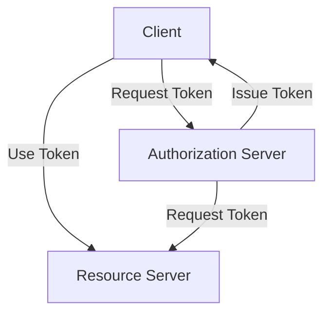

# udemy course on rest api
https://www.udemy.com/course/rest-api/
## prerequisite
- node
- mongodb
- 

## parts
- fundamental of api * api value chain
- rest api design principles and practices
- rest api implementation patterns
- rest api security
- building the api * swagger specifications
- api management

tips
- contextualise to org
- relate to pattern to use case
- go through api for example org

# api case study:
acme
    external services--> api management --> api --> backend 

# rest api framework (node.js)
    express
    hapi
     restify
     strongloop (IBM)

# api management platform
    ibm api connect
    mulesoft
    apigee
    
    akana 
    mashery
    wso2
    3scale

    mongo db atlas/cloud

# evolution of rpc and rest json
     
    api is an rpc mechanism

    1991 corba
    1998 soap

    rest is api that follows rest design principles

# rest
    representational state transfer
    6 principles
        uniform interface
            individual resources are identified in requests uri /url
            representation of resources
            self descriptive messages - metadata
            hypermedia
            crud
        stateless
            client manage its own state
            requests are self contained
        client server
            decouple
                no impact of change
                independent evolution
                separation of concerns
        cacheable
            http header to control the cache behaviour
            managing it's own state 
                lead to increase chattiness (multiple calls to get resources) because client need to send state data to server

            cache control directives (part of http header)
            cache-control
                can have multiple
                no-store, private, public, max-age
            expires
            last modified
            etag
            application (cache) <- api gateway/proxy (cache) <- api server (cache) <- database (read cache)
        layer system
            client > gateway > load balancer > rest api > database
            one layer only communicate with another
            no bypass
        code on demand
            hateoas
                hypertext as the engine of application state
                in response returned by server, also included subsequent potential action allowed to be done on the resource (aka subsequent rest api links)
                server knows the resource state - leads to efficiencies
                server may chagne the uri without breaking the client
                server may add new functionality

    RMM

        level 0 (not rest)    
            rpc, plain old xml (pox)
            http get & post
            soap
            typically dont use put or delete
        LEVEL 1 
            resources + uri
            
            pov collection of resources rather than endpoint or urls

            e.g. vacation reviews photograph
        level 2 
            resources + uri + http verbs
            verbs:
                get post delete put
            crud
                create post
                retrieve get
                update put
                delete delete
        level 3 
            hypermedia
            hateoas
        https://stackoverflow.com/questions/30967822/when-do-i-use-path-parameters-vs-query-parameters-in-a-restful-api

    web app vs rest api
        both use 
            client server
            layered
            caching
            code on demand (hateoas)
        uniform interface
            webapp
                no hard & fast rules
            rest
                strict rules & best practices
                contract resource identity
        statelessness
            webapp
                depend on the need
            rest
                server never manage application state
        http
            webapp 
                get post
            rest 
                crud

    webservice = rpc over internet
    http xml
    http soap/xml
    http json
    http rest

# why rest
        common set of design principals
        best practices for building and managing rest api
        compatible with any data format
        simplicity | flexibility

    rest is not tied to protocal, i.e. could be http

    what makes api restful
        set of principles
        architectural
        api exposes resources
    not tied to tech, standard, http/json

# types of api

    private 
        used by dev team internal

    public or external
        use from website/app

    partner
        trusted org

    no diff in implementation
    but in management

    considerations
        api security 
            token vs oauth secret
        access request
            email ticket vs portal
        documentiaton
            pdf vs webpage
        sla management
            monitor throughput and uptime tier for different types

# api value chain
    direct revenue (subscription)
    indirect benefit (ebay, fedex, indeed)
        partner eco system 
        agility
        brand recognition
        competitive advantage 
        social good
    end consumer of asset:
        individual users
            .
        enterprise users
            .
    asset -> api dev -> api -> app dev --> app -> end user

# api design
## api end point
    
    domain/product/version/resource/{id}

    base: domain
        - do not use www subdomain for api
        - api, app, developer
        - or separate url domain e.g. api.walmartlabs instead of api.walmart

    group name [optional]: product
        e.g. different team, grouping of resources.

    version: (multiple versions)
        switch between versions
        switch on own schedule
        (can also use header of query parameters)

    root url:
        domain+product+version
    
## practice for resource name, actiopn & associations
- most use plural for resource names
- operations on resource e.g. calc / report
  - search (action)
  - estimate/price
  - friendships/lookup
- resource associations
  - avoid deep nesting (max level 3)
  - use subquery to avoid deep nesting 
## contract and status code
- api call flow
  - client -> http verb -> rest resource
    - request: query param, header, body
    - response: status code (part of header), standard/custom header
        status code: 
            1xx, informational
            2xx success
            3xx redirect
            4xx client error
            5xx server error
    - body: data format, response schema
# crud 
- create post
  - request body contains the resource representation
  - return body may return new resource instance or link to the resource instance
  - 2xx success resource created
  - 4xx bad request, missing field
  - 5xx issue in processes, database not reachable
- retrieve get
  - request body is optional
  - 200 ok
  - 4xx bad request (resource not found)
  - 5xx issue in processing 
- update (put,patch)
  - 200 success (updated resource in body)
  - 201 created (body data optional)
  - 204 no content (in body)
- delete
  - 200 success delete resource in body
  - 204 no content (no content in body)
  - 4xx bad request 
  - 5xx issue in processing
- twitter use get and post for all their api

# data format
- support multiple format
- request/response
- client should be able to dictate how to receive format
  - options:
    - query parameter
    - http header accept:application/json (or csv etc ...)
    - resource format suffix e.g. forecast/daily{days}day.json
  - 415 unsupported type

# test environment 
acmetravel

# erro pattern
## api error handling practices
- patterns:
  - use header: status-code + reason-phrase + x-custom-header
  - status code = 200 + error in standard format (bad practice)
  - header + body: if status code = 2xx then body for resource info/link, otherwise body for error information (most preferred)
- on average 10 codes in use
- common codes
  - 200 ok
  - 201 created
  - 400 bad req
  - 404 not found
  - 401 unauthorized
  - 403 forbidden
  - 415 unsupported format
  - 500 server error
- more code is hard to manage
- xperia (14)
- tomtom (6)

## application error 
aka body of the error message to be given to ingester
- informative & actionable 
  - link to api doc
  - hint to address issue
  - message that may be presented to end users
- simple
- consistent

application api status code
    define and use numeric code
    e.g. 7002, required field vacation 'description' is missing

### vacation error template
text
timestamp
method: post get
endpoint
errors: array of
    code: application error code
    text: description
    hints: to dev on how to solve it
    info: link to doc for more info
payload: debug only (may contain sensitive data)

paypal also have debug id

### response envelope (very few api)
status
payload

experia
    error
    entity
Instead of sending back different HTTP status codes in responses, one can always send back a `200` code with a fixed `envelope` based approach. The response has a field that provides information on the errors.

# handling changes
## handling change
    - breaking changes vs non breaking changes
      - non breaking changes
        - add new resource operation
        - add optional parameter to resource
      - breaking
        - change the http verb or method
        - delete an operation
          - aka, deleting get vacation_by_dest and replacing it with generic search
    - backend changes can be either breaking or non breaking, it depends on specific scenario and no hard rules
      - can be major or minor
    - avoid changes: is it adding value
      - eliminate or minimize impact on app dev
      - provide planning opp to the app dev
      - support backward compatibility
      - provide support to app dev with changes
      - minimize change freq: once per 6 months e.g.
    - best practices to handling changes
## versioning
how to:
   use custom header
   use query parameter
   use url path parameter

version format:
    date
    major.minor
    number

example
- twilio:
date, url path param

- aws:
query parameter, date

- the movie db:
url path, number

- uber:
url path, v{number}

- stripe:
major version:
url path, v{number}
minor version:
http header, date

multiple version support key points
- support at least 1 pre3vious verison for a period fo time
    - e.g. 3 months
- mark the previou version as deprecated
    - no new dev can request access to the old api
- publish roll out plan in advance
- manage changelog that clearly shows the reason for new version

# cache control patterns
## cache control concepts and design
why cache:
- improve performance
- higher scalability /throughput

what to cache:
- speed of change 
- time sensitivity
- security

design decison
which component should control the caching
    - answer is api will control the caching
what to cache? who can cache (which components in the data flow)?
how long is the cache valid

## cache control directives
rfc 2616
public vs private - private:
    sensitive should not be cached on intermediary
    private data is meant for single user
no-store: not allow storage at any intermediary
etag- header can be used to check fi the data has changed

for high volume api, 
consider no-store and private for snesitive 
use etag for large responses
carefully decide on the optimal max-age

user end http override api cache directive header

ccd by default is public

# api response data handling patterns
## partial response
- single query parameter
  - /people/me?fields={Expression}
  - /people/me?fields=firstname,lastname
    e.g. linkedin
- multiple query parameter
  - query parameters only and ommit
    e.g. meetup
field projects vs filters

## pagination

### why support it 
- consumer in control of response 
- asks for number of rows
- similar to partial responses, optimise resource usage
  - cpu memory bandwidth
  - common api version for all consumers
  - e.g. to support multiple devices, use cases - form factors
### 3 common patterns
cursor based - facebook 
    envelope based response
    before after (the 1st record b4 (last rec prev page), and the 1st record after (first rec next page)) 
    previous next (the previous page and the next page)
    most efficient method
offset based - linkedin
    most common
    offset and limit

use of http header - github
    rfc5988
    have link for next and last in header

# security
## intro
    - data theft
    - data manipulation
    - identity theft
    - dos attack
    - who is the caller of api
    - transaction authorized
    - secure data
- data security: protection and integrity
- data at rest is outside scope of rest api
- data in motion is in scope of rest api
  - dont use self signed certs
  - tls
  - https

3 areas: authentication, authorization, functional attacks

## basic authentication
http header authorization: Basic {base 64 encoded user:password}

this cant work with http but only https/tls, because http does plain text

sessions is not allowed in rest api, because it is stateful

when you build local app (mobile) the basic auth means that the app stores the credentials to the api, meaning its not secure

requires requester to pass credentials with every request, because one should not manage sessions in rest api
npm passport.js for node.js

## token and jwt
token: encrypted strings

jwt (json web tokens) have 3 parts
header (base64) . payload (base64) . signature (hashing of header + payload with secret)

header {
  "alg": "HS256",
  "typ": "JWT"
}

payload: 
    - registered claims
        - iss: issuer
        - exp: expiration time
        - nbf: not before
    - public claims
      - name
      - email 
      - phone (whatever that identity the user)
    - private claims
      - agreed between consumer and provider
rfc7519

token may be set to expire, may be revoked

token may be send by consumer in header/body/query parameter/cookie depending on api implementation
## api key and secret

Both API key and JWT can provide authentication and authorization. API key is on project scope and JWT is on user scope.

API keys are considered to be vulnerable to man-in-the-middle attacks, so not as secure as authentication tokens (refer to Google Cloud API key doc).

Example use case for API keys is using Endpoints features such as quotas. Each request must pass in an API key so that Endpoints can identify the project that the client application is associated with.

https://softwareengineering.stackexchange.com/questions/419533/api-key-vs-jwt-which-authentication-to-use-and-when

## oauth2
## functional attack